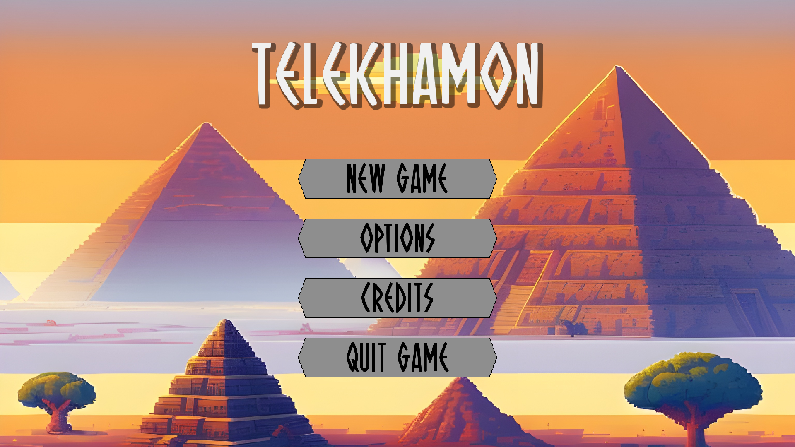
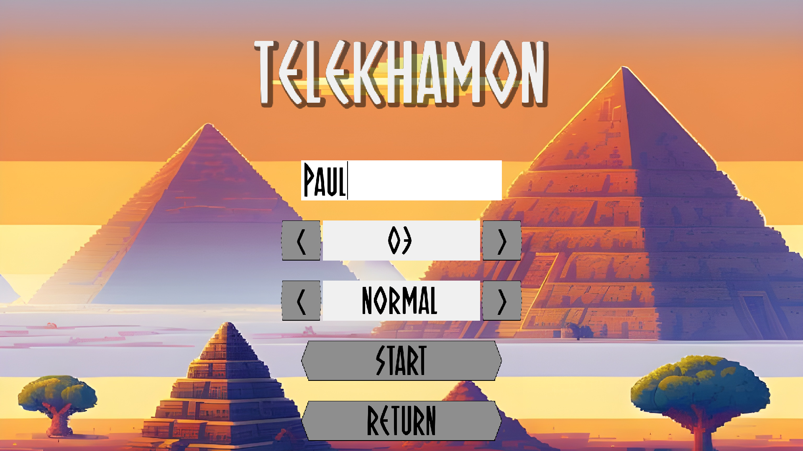
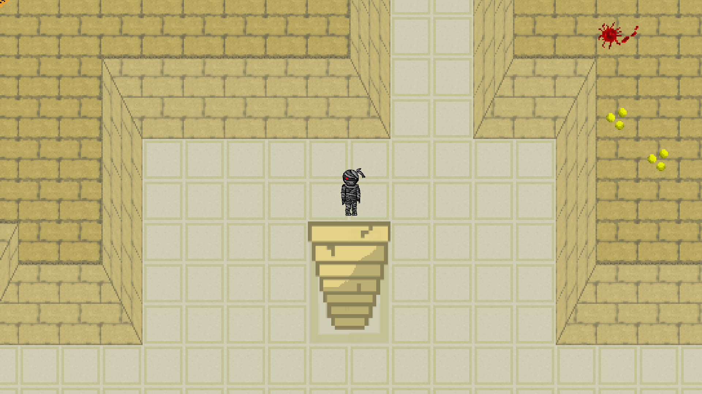
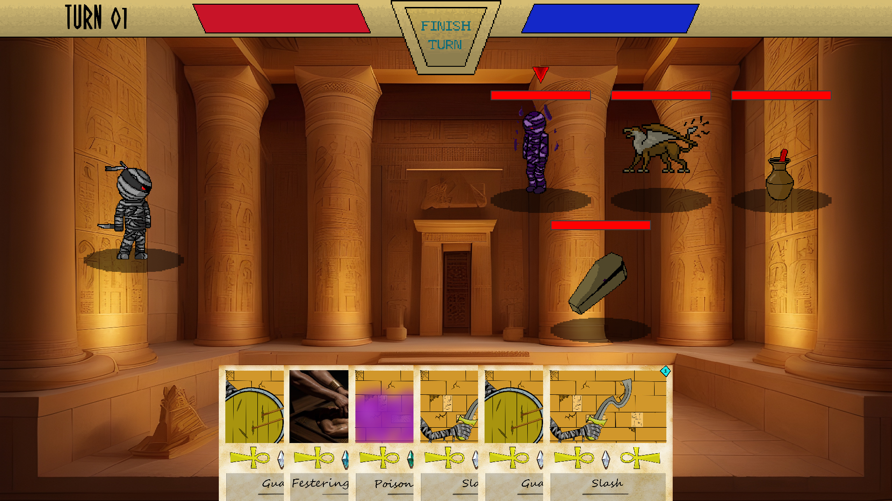
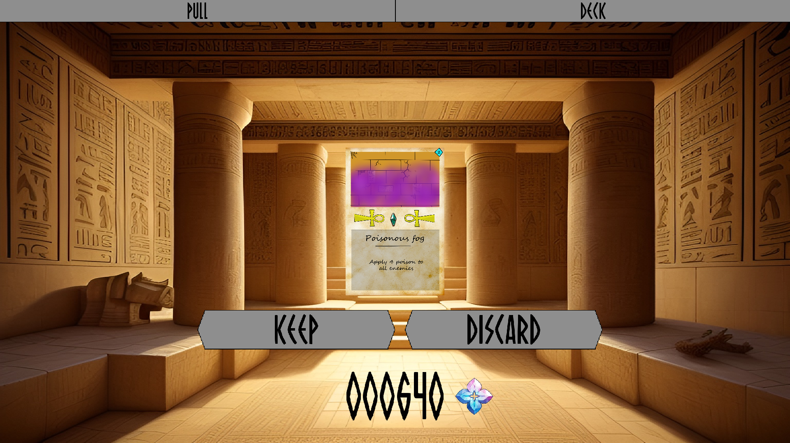
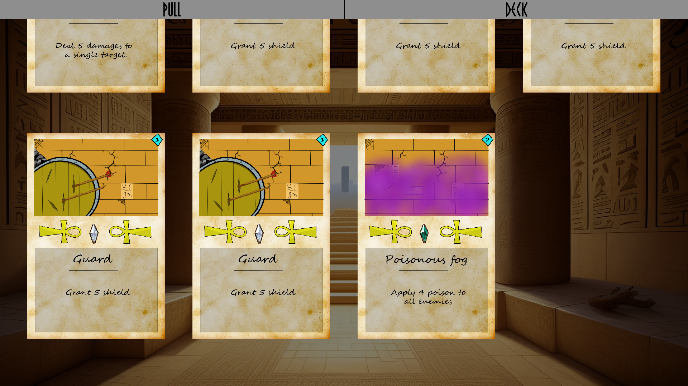
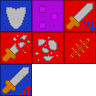
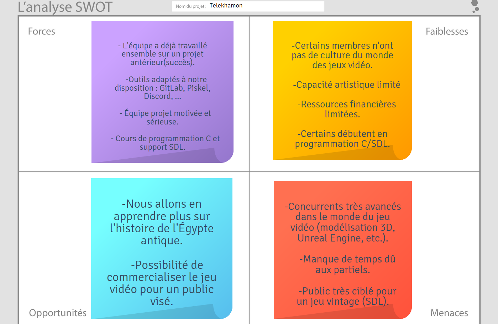
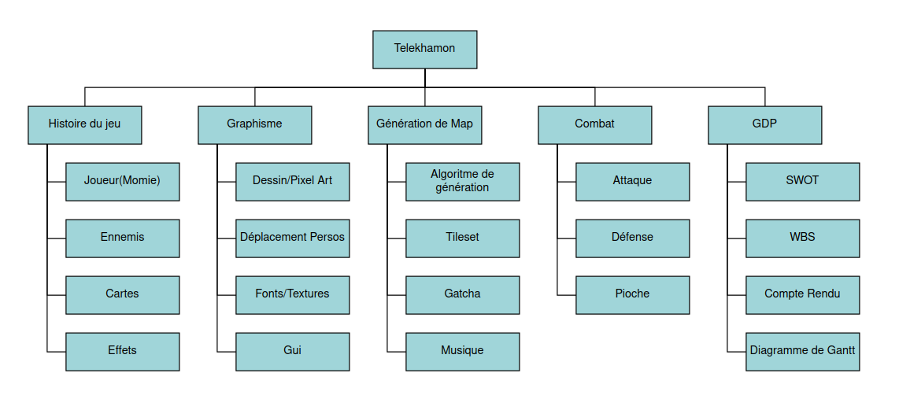

# TELEKHAMON



## Sommaire

* [Documentation](#documentation)
    * [Description du jeu](#description-du-jeu)
    * [Tutoriel](#tutoriel)
* [Répartition du Travail](#répartition-du-travail)
    * [Eliott](#eliott)
    * [Alexandre](#alexandre)
    * [Adrien](#adrien)
    * [Lucie](#lucie)
    * [Louis](#louis)
* [Détails Technique](#détails-techniques)
    * [Système de combat](#système-de-combat)
    * [Utils](#utils)
        * [List](#list)
        * [Stack](#stack)
        * [PriorityQueue](#priorityqueue)
* [Gestion de Projet](#gestion-de-projet)
    * [Matrice SWOT](#matrice-swot)
    * [WBS](#wbs)
    * [CR de Réunions](#cr-de-réunions)

## Documentation

### Description du jeu

Télékhamon est un rogue-like deckbuilder qui inclut des éléments de gatcha. Le joueur incarne une momie qui se déplace d’étage en étage au sein d’une pyramide remplie d’ennemis. Lors de sa progression, le joueur doit affronter différents ennemis dans des combats, il se bat à l'aide de cartes. Chaque victoire rapporte de l’argent, et celui-ci permet d’acheter des cartes choisies aléatoirement parmis plus de 20 cartes différentes. Afin de gagner la partie, le joueur doit vaincre le boss de chaque étage afin de s'échapper de la pyramide.

### Tutoriel

Les contrôles sont les suivants :

| Touche | Description |
|--------|-------------|
| Z ou Up | Permet de se déplacer vers le haut |
| Q ou Left | Permet de se déplacer vers la gauche |
| S ou Down | Permet de se déplacer vers le bas |
| D ou Right | Permet de se déplacer vers la droite |
| Tab | En jeu, permet d'ouvrir l'interface du deck et du gatcha |
| Echap | En jeu, permet d'ouvrir le menu de pause |
| F11 | Activer/Désactiver le plein écran |
| Clic gauche | Très probablement pour cliquer sur des éléments des interfaces graphiques! |

La première étape une fois le jeu lancé et l'intro passée, c'est de créer une nouvelle run :



Vous avez le choix entre 3 niveaux de difficulté, et a un nombre d'étages pour la pyramide entre 2 et 5 étages. Une fois le nom du joueur entré et le bouton start appuyé, la partie commence.



Pour progresser dans la pyramide, vous devez trouver l'escalier qui vous permet de descendre jusqu'au prochain étage. Vous risquez de rencontrer des ennemis en vous déplaçant dans les couloirs de la pyramide. Attention : s'ils vous repèrent, ils essaieront de vous attrapper. Un combat se lance également contre le boss de l'étage dès que vous essayez d'emprunter l'escalier.


Lorsque vous entrez en combat, l'interface suivante s'ouvre :



Sur la barre du haut se trouve :
* Le numéro du tour actuel
* La barre de HP (Health Points) du joueur, en rouge
* Le bouton pour mettre fin à votre tour
* La barre de EP (Energy Points) du joueur, en bleu (se régénèrent de 3pts par tour)

A gauche, c'est vous. A droite, les ennemis que vous affrontez. Ils sont entre 3 et 5 par combat. Vous pouvez viser un ennemi en cliquant sur celui-ci : une flèche indique l'ennemi actuellement visé. 

Enfin en bas, vous avez les cartes de votre main. Un combat commence avec 6 cartes en main chaque carte consomme une certain nombre d'EP pour être joué (en haut à droite de la carte), et vous pouvez jouer autant de carte que vous voulez pendant votre tour tant que vous avez suffisament d'EP. A chaque début de tour, vous piochez 4 cartes dans votre deck et régénerez 3 EP.

Si vos HP tombent à zéro, vous perdez la run et retournez au menu principal. Si vous gagnez le combat, vous récupérez une certaine quantité d'argent qui vous permet d'acheter des cartes.



Chaque carte coûte 160 pour être obtenue. Celle-ci sont choisies aléatoirement lors de leur achat en fonction de leur rareté. Vous pouvez choisir de conserver ou de jeter une carte achetée. Attention ! Une carte gardée ne peut plus être retirée de votre deck, donc choisisez avec soin quelles cartes vous voulez garder.

En mode Easy, vous commencez avec l'équivalent en argent de 10 cartes.

En mode Normal, vous commencez avec l'équivalent en argent de 5 cartes.



Il vous est également possible de visualisez les cartes que vous avez choisi de conserver, afin de voir comment vous avez construit votre deck et pour pouvoir déterminer de quel manière vous voulez le faire évoluer.



Il existe 7 effets différents qui peuvent être appliqués sur le joueur ainsi que sur les ennemis afin de rendre les combats plus intéressants.

### Bouclier :

Cet effet permet de réduire les degats subits (1 bouclier annule 1 dégat) et est consommé a chaque fois qu'il est utilisé, il est aussi remis a 0 a la fin du tour de l'entité (joueur ou adversaire).

### Poison :

Cet effet fait des dégats (1 dégat pour 1 poison) à la fin du tour de chaque entité, à chaque fois qu'il est appliqué le cumul d'effets est divisé par 2.
Le bouclier n'est pas pris en compte par les degats de poison.

### Faiblesse :

Cet effet réduit de 33% les dégats directs (tout sauf poison) infligés par les entités à d'autres entitées, le nombre de cumul est réduit de 1 à la fin de chaque tour (les cumuls ne n'appliquent que 1 fois).

### Faible :

Cet effet réduit de 1 les dégats infligés par une entitée à une autre, le nombre de cumuls est réduit de 1 à la fin du tour.

### Fragile :

Cet effet augmente les dégats directs subits par les entitées de 33%, le nombre de cumuls est réduit de 1 à la fin du tour.

### Blessé :

Cet effet augmente les degats directs subits par les entitées de 1, le nombre de cumuls est réduit de 1 à chaque fois que l'effet est appliqué.

### Force :

Cet effet augmente les dégats infligés par les entitées de 1, le nombre de cumuls est réduit de 1 à la fin du tour.

### Conclusion :

La formule qui donne les dégats directs infligés par une entitée (C) sur une cible (T) est donc :

Dégats = (Dégats_de_base + Force_C + Blessé_T) * (1 - 0,33*(MAX(1,Faible_C))) * (1 + 0,33*(MAX(1,Blessé_T)))

## Répartition du travail

### Eliott

**Algorithmes :** Aucun

**Librairies :** sqlite3 : accès aux données des ennemis, des skills des ennemis et ceux des cartes

**Fonctionnement:**

J’ai principalement travaillé sur le fonctionnement du système de combat, j’ai donc majoritairement créé mes propres structures pour représenter les ennemis, leurs compétences mais aussi le joueur et les cartes qu’il peut utiliser.
Puis créer des fonctions qui permettent de créer un lien entre toutes ces structures et l'interaction du joueur afin d’obtenir un système de combat fonctionnel.
La partie que j’ai trouvée la plus compliquée est que le nombre de variables à gérer dans chaque structures est assez élevé (beaucoup d’effets à gérer principalement) ce qui peut donner des fonctions assez peu esthétiques et difficiles à lire.

**Logiciels autres :** Clip Studio Paint,  Piskel

Ces logiciels m'ont servis a créer certaines textures (Clip Studio Paint pour les partie des cartes qui ont été faites a la main et Piskel pour les tileset, icones et animations).

### Alexandre

**Algorithmes :** Génération procédurale des étages de la pyramide, algo de décision des skills des ennemis.

**Génération du terrain :**

1. Générer des rooms aléatoirement : Des grandes rooms, des plus petites rooms (cachées dans un premier temps), des grandes rooms cachées, et des petites rooms cachées.
2. Leur assigner chacune aléatoirement une position polaire flottante (correspondant au milieu de la room) dans un cercle de rayon 1 et de centre O, de sorte que les rooms se superposent.
3. Trier les rooms par leur distance croissante au centre dans un array.

4. On place alors chaque room (ie lui donner des coordonnées cartésiennes fixes). Pour chaque room dans cette liste :
	a. Tant que cette room rentre en collision avec une autre qui est placée :
	b. La déplacer d'un rayon dr du milieu. *Initialement dr devait être faible (< 0.5), mais les rooms étaient alors bien trop souvent collées les unes aux autres à mon goût, c'est pourquoi il prend maintenant une valeur plus importante (~15), afin que les grandes rooms soient (dans la quasi-totalité des cas) séparées d'au moins une tile.*
	
	La room ne touche maintenant plus les autres déjà placées, alors on la place à son tour.
	c. Retrouver les coordonnées cartésiennes flottantes de la room.
	d. Assigner des coordonnées cartésiennes entières à la room, de sorte qu'elle ne rentre toujours en collision avec aucune autre.

5. Créer une seconde liste de rooms qui ne contient plus que les grandes rooms.
6. Pour chaque grande room :
	a. Ranger dans une liste les coordonnées polaires (par rapport au référentiel centré sur cette room) des 7 rooms grandes les plus proches de cette room. *Initialement on choisissait les 5 rooms les plus proches, 7 convient le mieux pour la complexité : La complexité de cette étape est en effet un peu plus élevée, mais la probabilité que l'étage généré soit connexe augmente drastiquement (Ce qui laisse alors moins de chance de devoir re-générer le même étage)*
	b. Pour chaque room dans cette liste de 7 :
		Créer une liaison entre les deux rooms si :
			Il s'agit de la première de la liste des 7 (On crée obligatoirement le chemin avec la grande room la plus proche).
			OU
			rk < 100 ET |theta_k - theta_0|mod(2*pi) > pi / 2 (On ne veut ni des liaisons trop grandes, ni des liaisons trop proches les unes des autres en angle).
7. Pour chaque liaison créée :
	a. Si le dx ou le dy entre les rooms est faible, créer un chemin droit entre eux.
	b. Sinon, créer un chemin anguleux dans les deux directions. *Cette partie était très calculatoire : tout l'enjeu est de trouver l'ensemble des coordonnées qui rendraient le chemin viable sur chaque paire de côtés de rooms. Les disjonctions de cas étaient nombreuses... Paire de rooms dans une diagonale ou dans l'autre, rooms se chevauchant en x, en y, suffisamment ou non pour créer un chemin...*

8. Rétablir alors les petites rooms intersectées par les couloirs créés.

9. Pour finir, on détermine la position des escaliers de spawn et de descente. L'escalier de spawn se trouve dans la room générée la plus proche des coordonnées de l'escalier de descente de l'étage précédent. L'escalier de descente se trouve dans n'importe quelle autre grande room qui ne contient pas l'escalier de spawn.

**Décision des skills des ennemis :**

* Paramètres :
Momie : PV et effets
Monstre : PV et effets
Alliés : PV

Capacités du monstre

Liste des capacités utilisées par le monstre jusqu'à présent


* Sortie :
Capacité à utiliser


* Contraintes :
Ne peut pas utiliser le même pattern 3 fois d'affilée *(vérification des triplets de patterns de taille 1, 2, et 3 seulement, sinon il existerait des cas dans lesquels les ennemis ne pourraient pas attaquer, du fait qu'ils n'ont que 3 skills)*.


* Algorithme :
1. Reconnaître les effets appliqués par chaque capacité.
2. En fonction des stats du combat actuel disponibles, classer les capacités par ordre de préférence d'utilisation pour le monstre, en utilisant un système de score. *Par exemple, un ennemi va avoir tendance à utiliser des dégâts sur la momie si il est en capacité de le tuer, si la momie a brittle ou à utiliser des attaques à hit multiples si elle a wounded... Au contraire, l'ennemi préfèrera se shield si il ne lui reste plus beaucoup d'HP, si l'ennemi a strength ou du shield lui-même... Tout comme il aura moins tendance à appliquer des stacks de brittle supplémentaires sur le joueur s'il en est déjà victime.*
3. Utiliser la capacité la plus appréciée par le mob telle que cette capacité respecte la contrainte.

**Librairies :** SDL, math, stdio, stdlib, time (pour le random), float, assert, string

**Fonctionnement :**
La moitié de mon travail a porté sur la génération procédurale des étages de la pyramide. Je me suis inspiré d’un algorithme vu en ligne pour commencer mon algorithme (générer X pièces de tailles “aléatoires” à des coordonnées petites et aléatoires, puis les espacer du centre jusqu’à ne plus avoir de collision entre elles). Puis je me suis adapté sans Unity ; pour faire simple, je déterminais, pour chaque pièce, les pièces avec lesquelles elle devait être reliée, puis j’ai créé les chemins entre tous ces couples de pièces, et enfin j'ai affiché de petites pièces générées aléatoirement entre les grandes pièces reliées. Plus qu’à mettre le tout dans une boucle while jusqu’à ce que la map générée soit connexe, déterminer les escaliers pour le spawn et la sortie, et le tour est joué.
Le reste du temps, j’ai travaillé sur les musiques du jeu et les bruitages, me suis occupé de petites choses à modifier dans le code, et ai écrit les fonctions de décision des ennemis en combat (““ia”” : Les ennemis possèdent tous trois attaques différentes, et lorsque vient leur tour d’attaquer, ils attribuent à chacune un score en fonction des paramètres du combat en cours, et utilisent, sans créer de patterns trop répétitifs, la meilleure des trois qu’ils peuvent).
C'était un projet des plus intéressants, qui m'a permi de découvrir la vraie valeur de la programmation dans le langage C, de combler mes lacunes en git et d'apprendre à réellement l'utiliser dans un projet de groupe.

**Logiciels autres :** Ableton Live 12 Trial, Audacity, Piskel


### Adrien

**Algorithmes :** Aucun

**Fonctionnement :**
Une partie de mon travail consistait à gérer les déplacements du personnage ainsi que les collisions avec l’environnement. Il fallait aussi générer des ennemis de façon aléatoire sur la map, et définir la position initiale de la momie.
La majorité du temps de travail a été consacrée à la partie visuelle du jeu, en dessinant les sprites et les animations de la momie et des ennemis, en s’assurant bien que chaque entité possède une idle animation ainsi qu’une animation d’attaque et de coup reçu. (J’espère ne plus jamais avoir à faire d’animations de déplacement de toute ma vie)
Logiciels autres : Piskel (my beloved)

### Lucie

**Algorithme :** A*

C'est un algorithme de recherche de chemin le plus court entre 2 entités à des endroits différents. Proposé en 1968, il s'agit en réalité d'une extension de l'algorithme de Dijkstra. La principale différence entre les deux algorithmes est l'utilisation d'une heuristique pour A* pour guider la recherche. 
L'heuristique choisie ici est la distance de manhattan (la même distance que les taxi qui parcourt les rues de manhattan). 

**Mise en place :** 
On crée une structure de nœud qui va représenter les cases de la map, ainsi qu'une structure de point. Le nœud contient ses coordonnées en 2D, 3 fonctions qui permettent de calculer sa distance entre le point de départ et le point d'arrivée et la case parent pour retracer le chemin. J'ai créee, en suivant, l'algorithme de A étoile, la fonction findPath qui permet donc de retrouver le chemin vers le joueur.
Elle consiste donc à parcourir, à partir de la case départ, les voisins et de calculer grâce à l'heuristique la prochaine case permettant d'atteindre la case finale(c'est à dire dans notre cas, là où se trouve le joueur) le plus rapidement. Pour ça, on utilise une queue qui permet ensuite de dépiler les parents et de retrouver le chemin. Selon l'endroit de la case, on va déplacer l'ennemi en conséquence. L'idée de la queue de priorité était celle de mon collègue Louis!

**Précisions :**
Tout commence avec le noeud de départ, que l'on initialise avec les coordonnées de l'ennemi et que l'on ajoute à la queue ouverte(les cases non visités). On rentre ensuite dans la boucle sur la condition que la taille de la queue des cases non visitées n'est pas vide. On cherche dans la liste le noeud qui à la fonction f(le coût) le plus bas, qui va devenir current. Au début, il s'agit donc du noeud de départ. On effectue un test pour savoir si la case courrante est la case sur laquelle se trouve le joueur,
et si c'est le cas, on reconstruit donc le chemin avec les parents puis on supprime les données. Si ce n'est pas le cas, on poursuis l'exploration des voisins. L'exploration, consiste en un parcours en largeur. On parcours les 8 cases adjacentes et on effectue des tests dessus pour vérifier que ce ne sont pas des mûrs ou qu'elles ne sont pas en dehors de la carte ou encore qu'on ne les a pas déjà visitées. Enfin, une fois trouvé, on peut calculer les nouveaux coûts associées et les insérer dans la queue des cases ouvertes.
A la fin des itérations, on ajoute la case courrante dans la liste fermé, qui contient donc les cases déjà visitées.

**Cartes et effets :**
J'ai créé une différentes structures et fonctions pour le joueur, les cartes et les effets. Cela comprend des fonctions pour l'attaque de l'ennemi en fonction de la cible(tout le monde, un seul ennemi, le joueur ou tous les ennemis). J'ai rencontré des difficultés concernant l'implémentation de la structure des ennemis et des fonctions d'attaque, que je trouvais trop complète, ainsi mon cher collègue Elliot à pris le relais pour le système de combat.

**Mon travail :**
J'ai donc participé dans la mise en place du système de combat et l'implémentation de l'algorithme de A*, permettant aux ennemis de retrouver la trace du joueur dans l'overworld.

**Autres :** 
sprites (piskel), gestion de projet (Latex)

**Conclusion :**
Grace à ce projet, j'ai pu développer mes compétences en langage C et découvrir un peu plus le monde du jeu vidéo, notamment grace à mes camarades, qui ont prit le temps de m'expliquer certains concepts et certaines définitions que je ne connaissais pas.

### Louis

**Algorithmes :** Aucun

Parmi les membres du groupe, je suis sans doute celui qui à passé le moins de temps à créer des ressources pour le jeu, et le plus de temps à coder. Mon travail consistait en la réalisation de toute la partie graphique du projet. De manière plus large, j’ai réalisé toutes les fonctions d’affichage et structures qui y sont liées, ainsi que toutes les interfaces graphiques. Ces parties du code ne demandent pas d’utiliser d’algorithmes complexes, mais elles sont lourdes et obligent à manipuler de nombreuses structures de données venues de tout le projet afin de les rendre correctement. Ainsi la structure que j’ai le plus manipulée est sans doute le SDL_Rect, pour l’affichage d’une texture sur une zone de l’écran.

Pour citer quelques exemples des réalisations que j’ai faites, on peut citer la structure Button, qui permet d’afficher un bouton cliquable qui exécute une fonction passée en paramètre, différentes fonctions de rendu de texte qui, à partir d’une chaine de caractère, crée une texture (il est par exemple possible avec un formatage du texte que j’ai introduit de choisir la couleur de certaines sections du texte), la structure Transition qui permet de passer d’un état A vers un état B pour un quelconque objet (cela permet de déplacer des cartes automatiquement, en faisant varier leur vitesse et leur alpha en cours de route par exemple), ou encore quelques structures de données comme List, Stack ou PriorityQueue qui sont utilisées ailleurs dans le code. Je suis également assez fier de l'introduction du jeu à la Star Wars. Simuler un rendu 3D en 2D n’a pas été facile : rendre une texture sur un trapèze cause des déformations visuelles que j’ai dû corriger en découpant le trapèze en de nombreuses petites sections plus proches d’un carré lors du rendu. 

Enfin, j’ai passé un temps non négligeable à corriger différents bugs, fuites de mémoire et à aider mes camarades à debugger leur code. En effet, ayant 6 ans d’expérience en C++, j’ai des facilités à lire, écrire et comprendre le C, ce qui permet de gagner du temps dans la correction de bugs.

**Logiciels :** VSCode, gdb et Valgrind

## Détails Techniques

### Système de combat

Le joueur est geré a l'aide d'une structure Player qui contiens toutes les informations nécessaires, notament ces points de vie et points de vie maximums, son argent et son deck actuel.

Les cartes sont gerées à l'aide d'une structure Card qui contient la texture, le coût, la probabilité d'obtention dans le gatcha ainsi que les effets.

Les ennemis sont gerés à l'aide d'une structure Ennemi qui contient des données sensiblement identiques a celles du joueur, mais en plus leurs compétences.

Les compétences sont gerés dans une structure Skill qui contient les effets appliqués sur la personne qui utilise la compétence, ainsi que les cibles et la manière avec laquelle ils sont appliqués (seulement sur celui qui l'utilise, sur tout le monde, seulement sur une cible), cette structure est identique a celle qui est utilisée pour les données des cartes.

La plupart de ces données sont stockées dans une base de donnée et recuperées au début du combat ou bien au début d'une partie en fonction des besoins.

il existe ensuite des fonctions qui prennent en arguments ces différentes structures pour appliquer les effets sur les cibles ainsi que des fonctions pour appliquer les dégats sur les cibles.

Ces fonctions pour gerer les dégats sont séparées de la fonction pour appliquer les effets en raison de la complexité de la formule de dégats.

Il existe aussi des fonctions qui servent à être appelées à chaque fin de tour afin de diminuer ou bien appliquer les effets qui s'activent en fin de tour.
### Utils

Le répertoire utils contient des structures de données utilisées un peu partout ailleurs dans le code. Celles-ci sont décrites ci-dessous.

#### List

Permet de créer une liste d'éléments de type void*. Elle est utilisée partout dans le code. Elle est implémenté par un tableau dynamique de void*. Ses méthodes sont :

```c
// Construit une liste vide de taille initiale cap.
// O(1)
List* createList(unsigned int cap);

// Détruit une liste sans détruire les void* qu'elle contient.
// O(1)
void freeList(List* list);

// Ajoute un élément à la liste.
// *O(1)
void listAdd(List* list, void* elt);

// Supprime un élément de la liste par index.
// O(n)
void listRemove(List* list, unsigned int i);

// Recherche un élément dans la liste.
// O(n)
unsigned int listFind(List* list, void* elt);

// Récupère une valeur dans la liste.
// O(1)
void* listGet(List* list, unsigned int i);

// Permet de définir une valeur dans la liste.
// O(1)
void listSet(List* list, unsigned int i, void* elt);

// Renvoie la taille de la liste.
// O(1)
unsigned int listSize(List* list);

// Vide la liste.
// O(1)
void listClear(List* list);

// Fonction de trie de la liste.
// O(nlog(n))
void listSort(List* list, int (*cmp)(const void*, const void*));
```

\* La taille de la liste est doublée des qu'elle est pleine via un realloc, ce qui donne une complexité pire cas de O(n), mais une complexité amortie en O(1).


#### Stack

Permet de créer une pile. Elle est utilisée par exemple pour renverser le chemin renvoyé par A*, qui est ensuite dépilé par l'ennemi pour avoir la succession de cases le menant au joueur. Cette structure est implémentée par liste simplement chaînée de void*. Ses méthodes sont :
```c
// Construit un Stack vide.
// O(1)
Stack* createStack();

// Détruit un Stack sans supprimer les void* qu'il contient.
// O(1)
void freeStack(Stack* stack);

// Empile une valeur sur le Stack.
// O(1)
void stackPush(Stack* stack, void* value);

// Supprime un élément de la pile et renvoie sa valeur.
// O(1)
void* stackPop(Stack* stack);

// Renvoie la taille du Stack.
// O(1)
int stackSize(Stack* stack);
```

#### PriorityQueue

Permet de créer une file de priorité. Celle-ci est principalement utilisée dans A*. Elle est implémenté par une liste simplement chainé d'éléments de type void* et de priorité de type float. Les méthodes sur ce type sont :
```c
// Construit une PriorityQueue vide.
// O(1)
PriorityQueue* createPriorityQueue();

// Détruit une PriorityQueue.
// Détruit les cellules de la liste chaînée sans toucher aux void* contenus dedans.
// O(1)
void freePriorityQueue(PriorityQueue* queue);

// Renvoie la taille de la file.
// O(1)
int priorityQueueSize(PriorityQueue* queue);

// Permet l'insertion d'une valeur avec sa priorité en début de la liste chaînée de la file.
// O(1)
void priorityQueueInsert(PriorityQueue* queue, void* value, float key);

// Supprime l'élément de priorité minimale de la liste et renvoie la valeur correspondante.
// O(n)
void* priorityQueuePop(PriorityQueue* queue);
```

L'implémentation de la liste étant faite par liste chaînée, la recherche du minimum est en O(n). Cela peut-être optimisé par une implémentation par arbres en O(log(n)), mais comme l'implémentation actuelle ne pose pas de problèmes de performance, cela n'as pas été fait.

### Matrice SWOT

Voici la matrice SWOT du projet :



### WBS

Voici le WBS du projet :



### CR de Réunions

Les comptes rendus de réunions sont disponibles [ici](./docs/ppii2.pdf)
